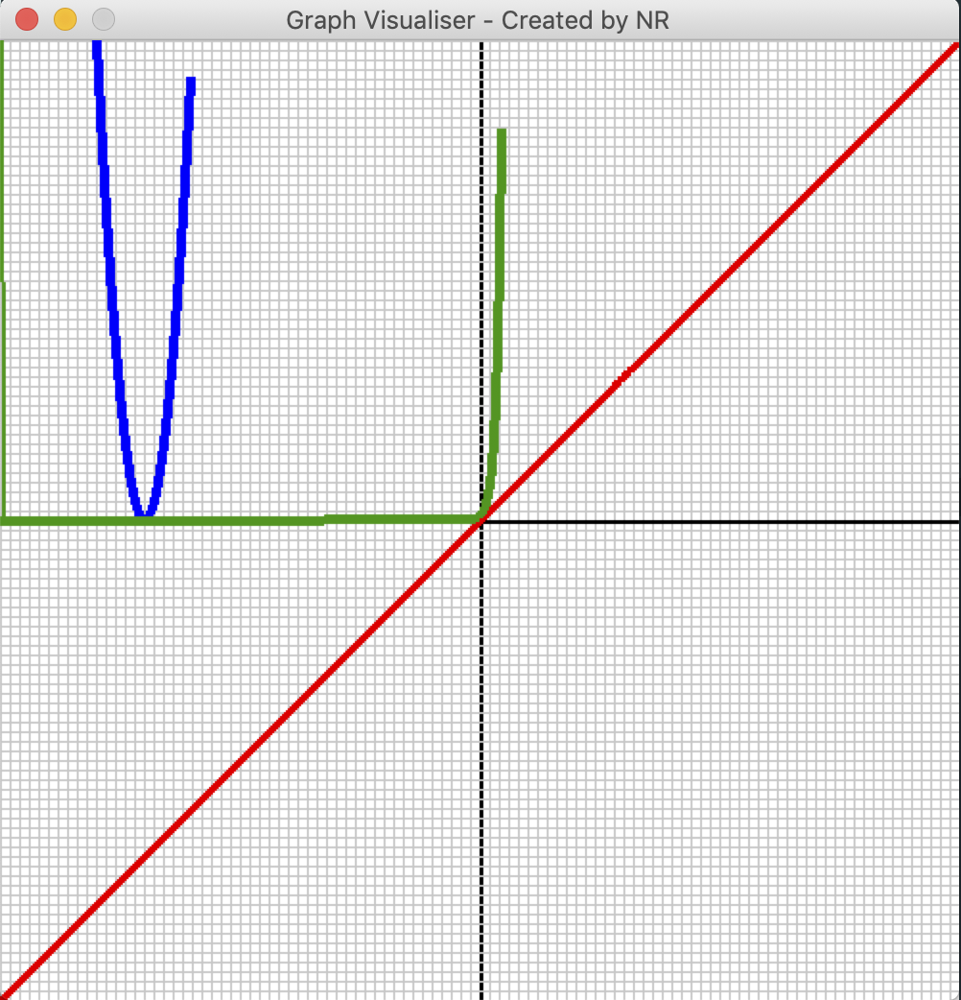

# Graph Visualiser
> Created by Nicholas Ramsay




- Uses python3 + pygame
- Draws lambda expressions on a plane

## Example
```python
graph = Graph(screen, fromX=-100, toX=100, fromY=-100, toY=100)
graph.AddFunction(Function(lambda x : x, color=(255,0,0), width=5))
graph.AddFunction(Function(lambda x : (x + 70) ** 2, color=(0,0,255), width=5))
graph.AddFunction(Function(lambda x : math.e ** x, color=(0,150,0), width=5))

```